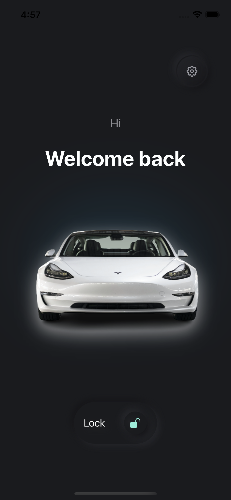
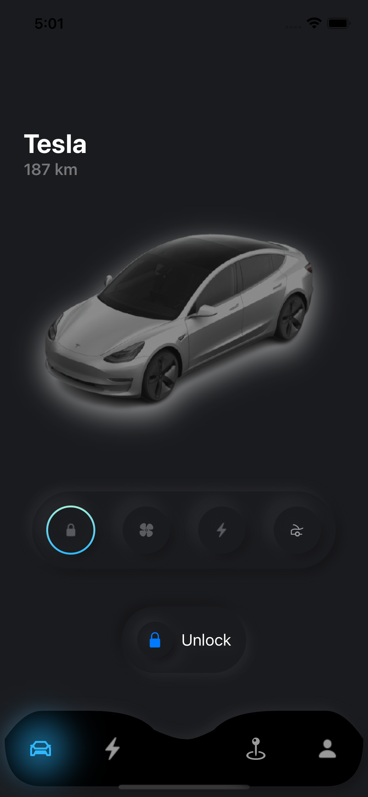
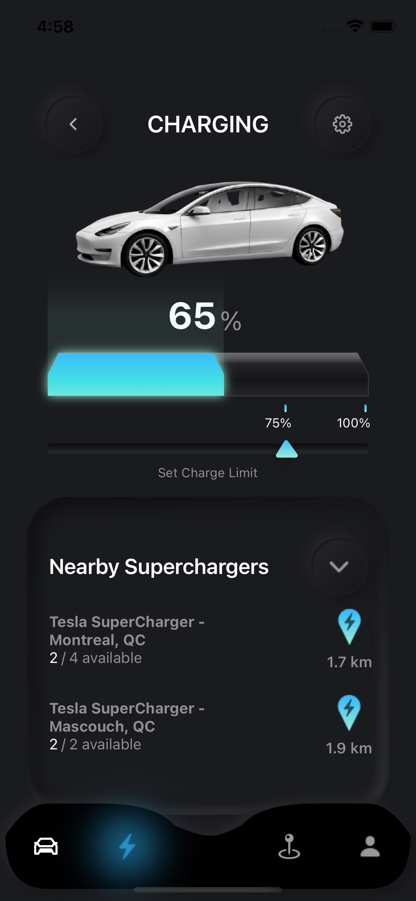
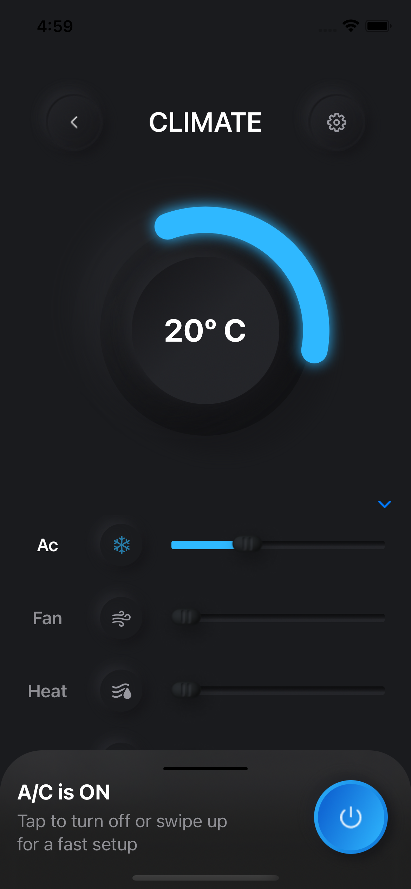

# TeslaApp project
The application displays data for interacting with the Tesla car, displays climate control and charge information.

  
   
  
  

*  Main screen of application display lock/unlock.
*  Second screen display climate control information.
*  Third screen displays the amount of charge and the nearest charging stations.
